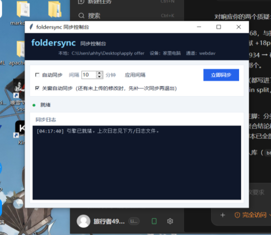

# foldersync —— 两机文件夹同步工具

在两台**不在同一局域网**的电脑之间同步一个文件夹（比如桌面的 `apply offer`）。
同步引擎是本目录下的 `foldersync.py`，端到端加密，传输通道可插拔。



## 它做了什么

- **实时同步**：监视文件夹变化即时上传/下载，另有每 10 分钟一次全量扫描兜底
- **端到端加密**：口令派生密钥（scrypt），文件名和内容都用 AES-256-GCM 加密后才离开电脑，
  坚果云（或任何中转）看不到任何可读信息
- **删除有墓碑**：能区分"对方删了文件"和"对方还没见过这个新文件"，不会瞎恢复
- **冲突不丢数据**：两边都改了同一文件时，保留两个版本，另一份存成
  `文件名 (冲突来自 设备名 时间).ext`，由你决定怎么合并
- **离线友好**：不要求两台同时在线，任何一台上线后会自动补齐差异
- **原子写入**：先写临时文件再替换，断网断电不会留下半个文件

## 文件说明

| 文件 | 用途 |
|---|---|
| `foldersync-gui.exe` | **图形界面（推荐日常使用）**，双击即用 |
| `foldersync_gui.py` | 图形界面源码 |
| `foldersync.py` | 全部核心代码（单文件，约 600 行） |
| `config.example.toml` | 配置模板，复制为 `config.toml` 后填写 |
| `前台运行（调试用）.bat` | 在可见窗口里跑命令行版，看日志排错用 |
| `安装开机自启.bat` / `移除开机自启.bat` | 可选：命令行版的计划任务自启 |
| `test_simulate.py` | 双机模拟测试（9 个场景） |
| `重新打包.bat` | 修改代码后重新生成 exe |

## 图形界面（推荐）

双击 `foldersync-gui.exe`（需与 `config.toml` 在同一目录）：

- **立即同步**：手动同步一次，结果（推送/拉取/删除/冲突数）显示在状态栏
- **自动同步**：勾选开启、再点取消；**间隔**自己定（1~720 分钟），改完点"应用间隔"，
  设置会记住，下次打开还是你上次的配置
- **关窗自动同步**（默认开启）：关闭窗口时若还有没上传的修改，先自动补一次同步再退出
  （补同步过程中再点一次关闭可跳过）；没有任何待传内容时立即关闭，不会拖泥带水
- 界面里有实时同步日志；完整日志文件在 `%LOCALAPPDATA%\foldersync\<profile>\foldersync.log`

**第二台电脑不需要装 Python**：把 `foldersync-gui.exe` 和填好的 `config.toml`
（`device` 改个名）拷过去，双击 exe 点"立即同步"即可完成首次拉取。

修改了 Python 代码想重新打包：双击 `重新打包.bat`，或执行
`python -m PyInstaller --onefile --windowed --name foldersync-gui foldersync_gui.py`。

## 命令行方式（可选）

前提：装好 Python 3.8+（勾选 Add to PATH），然后在本目录执行：

```
pip install -r requirements.txt
```

1. **坚果云端**：浏览器登录坚果云网页版 → 账户信息 → 安全选项 → 添加"应用密码"。
2. **配置**：复制 `config.example.toml` 为 `config.toml`，填 4 个关键项：
   - `local_folder`：要同步的文件夹（如桌面上的 `apply offer`）
   - `device`：设备名，两台电脑取不同名字（如 `家里电脑` / `公司电脑`）
   - `passphrase`：加密口令，两台必须一致，**忘了无法解密远端数据**
   - `[transport]` 里的坚果云邮箱和应用密码
3. **初始化**（第一台电脑）：
   ```
   python foldersync.py init
   ```
   会创建远端目录结构并完成首次上传。
4. **第二台电脑**：同样配置（`device` 换个名）后同样执行 `init`，首次会把文件全部拉下来。
5. **常驻**：双击 `安装开机自启.bat`。之后每次开机它都在后台自动同步。

## 命令

```
python foldersync.py check    # 测试连接和口令是否正确
python foldersync.py once     # 手动同步一次
python foldersync.py run      # 常驻模式（实时监视 + 定时扫描）
python foldersync.py init     # 首次初始化（=建远端结构 + 同步一次）
```

日志写在 `%LOCALAPPDATA%\foldersync\<profile>\foldersync.log`。

## 不想用坚果云？

把 `config.toml` 的 `[transport]` 换成目录直连：

```toml
[transport]
type = 'localdir'
remote_dir = '\\对方电脑名\共享文件夹\foldersync-offer'
```

配合 Tailscale/ZeroTier 把两台电脑组成虚拟局域网后用共享目录，数据完全不经过任何第三方
网盘；U 盘/移动硬盘也可以当这个"远端"来背着走。

## 冲突怎么处理

两边**先后**都改了同一个文件再同步时，后同步的一边会：
- 保留自己正在编辑的版本在原文件名里；
- 把对方版本存成 `原名 (冲突来自 对方设备 时间).后缀`。

你对比两份内容，合并后删掉多余的那份即可。日常避免方法：换电脑前确认上一轮已同步完成
（`once` 一下），同一份文件不要在两边同时开工。

## 已知限制（v1）

- 文件改名按"删除 + 新建"处理，另一端会重新下载一份
- 不同步空目录；文件整体传输，不做增量
- `passphrase` 只保护云端数据，保护不了能直接读你硬盘的人
- Word 打开时的临时锁文件（`~$` 开头）会自动跳过，但请正常保存关闭后再离开电脑

## FAQ

- **坚果云的配额够用吗**：元数据带 ETag 缓存，没变化的文件不会重复下载，稳态下一次同步
  只有约 8 个请求、流量几十 KB；免费账户的每日请求次数和每月 1GB 上传流量对文档场景绰绰有余。
- **想换加密口令**：最稳妥是"清空坚果云上的 foldersync 目录 + 删除两台电脑的
  `%LOCALAPPDATA%\foldersync\` 状态目录 + 两边重新 `init`"。
- **想同步第二组文件夹**：复制一份 `config.toml`（改 `profile`、`local_folder`、远端 url
  末尾路径），用 `--config` 指定它再装一个计划任务。
- **怀疑没同步**：先 `python foldersync.py once`，再看日志；或 `check` 测连接。

## 下一步计划

只是列出来，能不能想push AI 做就不一定了hhh :)
- 优化界面
- 可以自定义哪些文件不同步
- 可以多个文件夹同步
